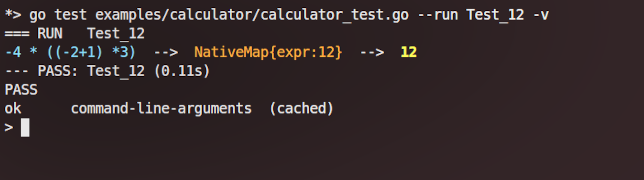
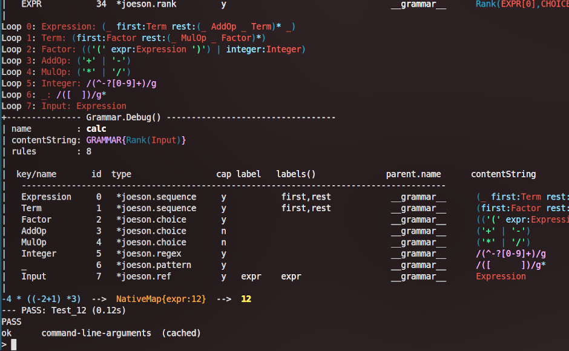
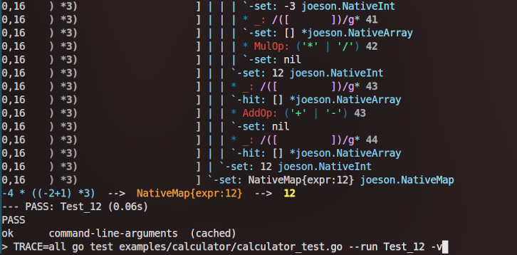

A Golang Packrat parser with [Left Recursion](https://raw.githubusercontent.com/jaekwon/JoeScript/master/docs/ipplrs_douglass.pdf) ported from [https://github.com/jaekwon/JoeScript](https://github.com/jaekwon/JoeScript) and written for the gnoland project.

This is a library, for now there is no binary; only tests and examples.

Warning: this port is as literal as possible. It's main documentation is meant to be the original JoeScript code. Once it becomes more established it can become its own thing and evolve in a more golang-idiomatic way.

# Usage

Run all tests recursively:

```
$ go test ./...
```

Run named test:

```
$ go test . --run TestHandcompiled -v
```

Run a certain test from examples/calculator:

```
$ go test examples/calculator/calculator_test.go --run test_12 -v
```



## Enabling more traces

It's possible to choose trace categories to show right from the command-line, using the `TRACE` env variable.

Here is the same command-line as before with a `TRACE=all` prefix, affecting "all" to the environment variable `$TRACE`.

```
$ TRACE=all go test examples/calculator/calculator_test.go --run Test_12 -v
```

It shows very detailed trace:



Same with just the loop and grammar traces. This time we typed `TRACE=loop,grammar` in front of the go command-line:

```
$ TRACE=loop,grammar go test examples/calculator/calculator_test.go --run Test_12 -v
```



This `$TRACE` variable is simply read by the go (and the modified coffeescript version, to be able to diff without editing any code) and the `TraceOptions` structure fields are then set or unset accordingly.

Here are the possible values:

| Name       | Behavior                                          |
| ---------- | ------------------------------------------------  |
| none       | disable everything                                |
| stack      | print detailed parsing steps                      |
| loop       | print all rules in the grammar                    |
| grammar    | print grammar information and all rules           |
| skipsetup  | mute traces during joeson grammar setup           |
| all        | print all that makes sense                        |
| line='N'(⁺)| only the stack trace for the nth line of code (⁺) |

So for example: `TRACE=all,skipsetup go test . --run=TestSquareroot -v`

⁺: doesn't work well: all lines of code with the line system are line 0. We should probably use parseContext.Counter instead (TODO)

# Joeson, what else

## What is a packrat parser?

Packrat are parsers for PEGs ([Parsing expression grammars](https://en.wikipedia.org/wiki/Parsing_expression_grammar)). The classical theory has dealt with Context Free Grammars (CFG) in computer science since the 70s, the LL and LR parsers have been very well known and understood. PEG parsers are more recent (2000s). It doesn't necessarily mean they are superior, but the tradeoff is interesting.

## What is a Parsing Expression Grammar and how does it differ from a Context Free Grammar (PEG vs CFG)?

* a PEG is easier to write and easier to maintain than a CFG. With parsing expression grammars you can even plug subgrammars, something that is unthinkable with context-free grammars.
* PEG parsers can consume much more memory than CFG parsers because of memoization. CFG parsers appeared in the 70s and are extremely space efficient.
* PEG are fast too and parse in linear time, O(n)

Here is a more detailed explanation of the differences: [https://stackoverflow.com/questions/1410477/what-is-packrat-parsing](https://stackoverflow.com/questions/1410477/what-is-packrat-parsing)

## How to write a joeson grammar

TODO

## How is a grammar parsed?
## Why are there 2 joeson grammars?

```
GRAMMAR FILES
---------------------------------------------------------------------------
joeson_intention.go     from which actual handcompiled is written
joeson_handcompiled.go  the actual grammar, manually compiled from intention
-----------------------------------------------------------------------------
```

A grammar is a collection of rules. But saying that is a little bit vague.

Consider the case where those rules are expressed as *strings*. 
They *do* form a grammar. But that grammar is a theorical thing because strings are just strings.
Such a grammar has not yet been compiled into anything potent. Nonetheless it's
important. If we have a way to compile it, that grammar may one day be 
transformed into a compiled grammar capable of parsing, transforming stuffs.

This is what `joeson_intention.go` is, an uncompiled grammar representing how
we would express the Joeson grammar written in Joeson. A readable grammar, the
design of that grammar.

## How does the handcompiled grammar work? (from a high altitude)

`joeson_handcompiled.go` is the magical AST that can compile the intention
grammar or any valid grammar written in joeson.

```
      input    ----- parsing ----->    AST
```

In the same way strings can be used for almost anything, AST can be used for almost anything. In the multitude of AST usages however, compiling grammars do output very special AST nodes:

* A *compiling grammar* is able to take, as an **input**, *string rules*.  
* Its **output**? Compiling grammars output AST capable of parsing, hence they have a `func Parse(ctx) Ast`.

In the beginning, we need one *stringless* grammar, one that *does not need to be compiled*. Otherwise, we never can compile anything. 

If just *one* of its rules was a *string*, a grammar still wouldn't be a *compiling grammar*, it would not be self-sufficient. 

This is why we have `joeson_handcompiled.go`. The rules of this grammar are composed of internal ast nodes capable of PEG parsing **primitives** (those primitives are: ref, sequence, choice, pattern, str, lookahead, not, rank and regex).

It is now possible to compile the intention grammar with the handcompiled one, the result can be called a *bootstrapped* grammar. That byproduct is also a *compiling grammar*, so we can now compile with either the bootstrapped intention grammar or the handcompiled grammar.

## What are the applications?

We probably don't know yet ;)

