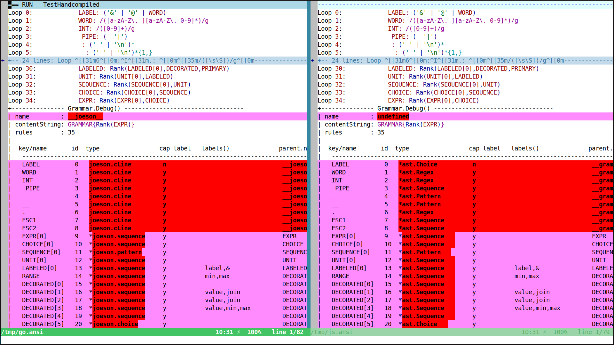

diff_go_vs_coffee is a bash script using the tool vimdiff (part of the vim editor distribution)
to show the trace differences between the go and coffeescript implementation of joeson.

# Before using this tool

* Make sure to edit the "joePath=~/Work/GNO/JoeScript" in the file so it points to whereever you installed your JoeScript.

* Install https://www.github.com/powerman/vim-plugin-AnsiEsc :: It will give a `:AnsiEsc` command that shows ansi colors in vim. Without this, you're better off using some `diff` variant because of escape sequences.

* You may want this line in your vimfile `autocmd BufRead *.ansi AnsiEsc` to auto-enable AnsiEsc on files with an `.ansi` extension

# Example of a session

$ represents the prompt (bash, zsh).
At first you can try to launch it. It will tell you it doesn't know what test to run.

```
$ contrib/diff_go_vs_coffee
The test to run must be specified with '--test <NAME>' or '-t <NAME>', tests below:
- ParseIntention
- ManyTimes
- DebugLabel
- Squareroot
- Choice
- Choice2
(js tests: Handcompiled,DebugLabel,ManyTimes )
```

We will pass "hand" here, it will match Handcompiled for both go and coffee.
The search is not a regex, it's also case-insensitive. 

```
$ contrib/diff_go_vs_coffee --test hand   # <- "hand", case-insentive and non-regex comparison, will find Handcompiled
```

Something like this appears:



## When one side (go or js) is empty or seem to behave incorrectly, use --only

For instance suppose `contrib/diff_go_vs_coffee --test debuglabel` opens vimdiff with no output at all for the coffee/js side. 

We would then like to forget about the diff operation and running the js side independently.
Just add `--only js` (`coffee`, `coffeescript`, `javascript` are also recognized).

`contrib/diff_go_vs_coffee --test debuglabel --only js`

This won't launch vimdiff, but will run the test in the terminal so you can see what happens.

## Some useful keys while in vimdiff

* `<Esc>:AnsiEsc<CR>` :: toggle ansi colors (if you haven't mapped the .ansi extension)
* `h`, `j`, `k`, `l` :: move around (in normal mode)
* `<Ctrl-w> + w` :: jump to the opposite split window
* `zo`, `zc` :: open fold, close fold
* `<Esc>:q<CR>` :: quit

## Tracing options

The `$TRACE` environment variable is transmitted to joeson in either implementation. 
You should remember in a shell, `FOO=foo ./baz` executes the file `./baz` after 
affecting "foo" to the environment variable `$FOO`, which will be available to program
runned. `FOO=foo BAR=bar ./baz` has a second one called `$BAR`.

With diff_go_vs_coffee here are a few examples:

* `TRACE=all contrib/diff_go_vs_coffee -t handcompiled`
* `TRACE=stack,skipsetup contrib/diff_go_vs_coffee -t debuglabel`
* `TRACE=loop,stack TEST=handcompiled contrib/diff_go_vs_coffee`
* `TRACE=all,skipsetup contrib/diff_go_vs_coffee -t word`

You will note from third example `$TEST` can also be used instead of `-t <TEST>`. 

A quick recap for `$TRACE`:

- **all** will enable all traces, **none** is the opposite.
- **grammar** is a very succint trace showing the rules of the grammar in a table.
- **stack** is by far the most verbose one and will show all parsing steps.
- **stack,skipsetup** will show the parsing steps, but only once grammars are compiled.
- **loop** merely lists the rules and will probably be deprecated soon.

Trace options must be separated by a comma. The order when you use something like `all` is important. For instance, `all,skipsetup` makes sense, but `skipsetup,all` does not because all will reset everything.

Please refer to the [main documentation][../README.md] for all the possible values.

